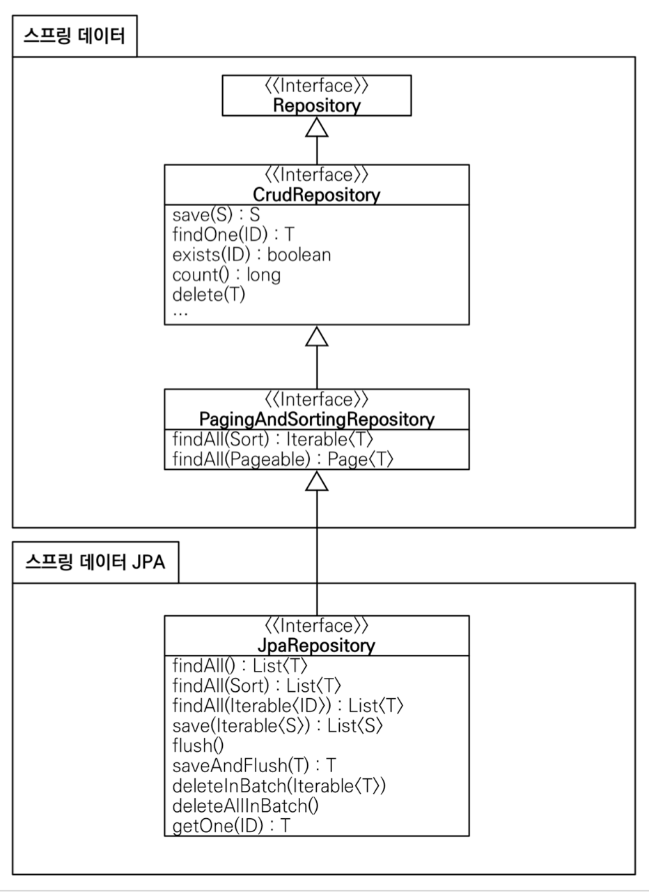
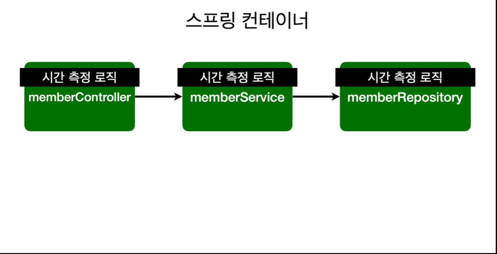
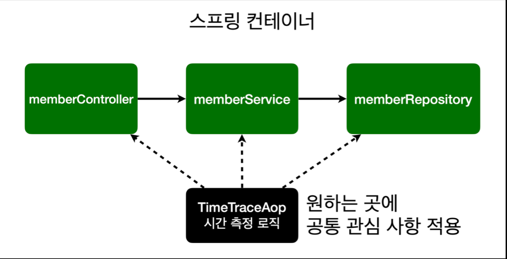
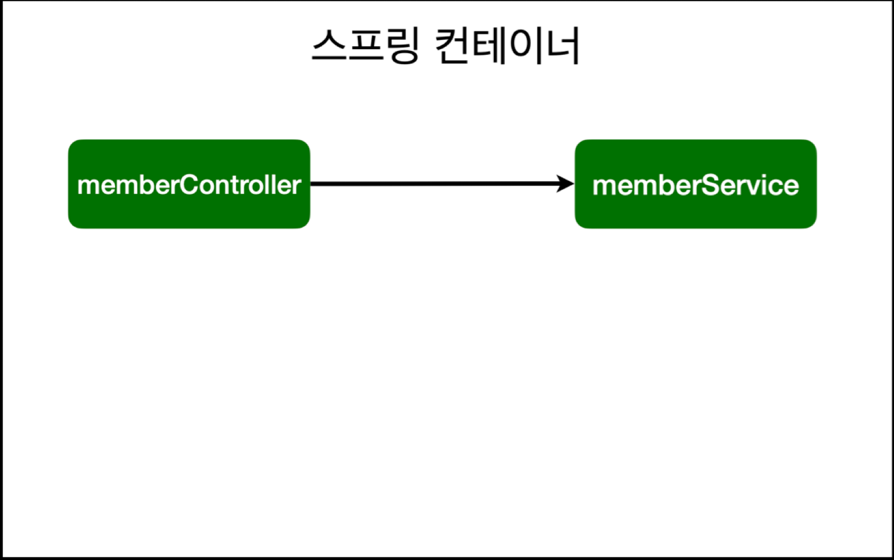
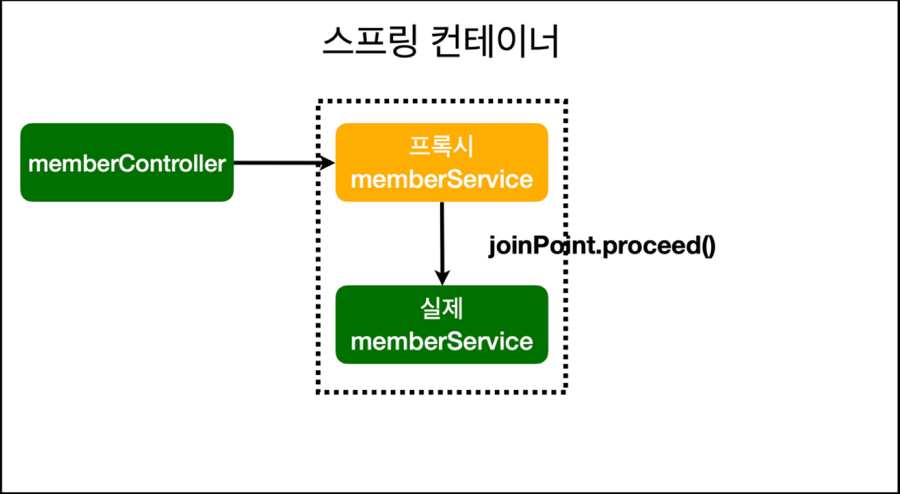

# 스프링 입문 - 코드로 배우는 스프링 부트, 웹 MVC, DB 접근 기술
> 우아한형제들 기술이사 김영한님 강의를 듣고 내용 정리


<details>
<summary>Table of Contents</summary>

- [2022.02.16](#20220216)
- [2022.02.21](#20220221)
- [2022.02.22](#20220222)
- [2022.02.23](#20220223)
- [2022.02.24](#20220224)
- [2022.02.25](#20220225)
</details>

***

## 2022.02.16
### 강의 내용
- 프로젝트 생성
- View 환경설정
- 빌드하고 실행하기

`hello_spring/src/main/java/hello/controller/helloController.java`
```java
package hello.hellospring.controller;

import org.springframework.stereotype.Controller;
import org.springframework.ui.Model;
import org.springframework.web.bind.annotation.GetMapping;

@Controller
public class HelloController {
    @GetMapping("hello")
    public String hello(Model model) {
        model.addAttribute("data", "hello!!");
        return "hello";
    }
}
```
`hello_spring/src/main/resources/templates/hello.html`
```html
<!DOCTYPE html>
<html xmlns:th ="http://www.thymeleaf.org">
<head>
    <meta charset="UTF-8">
    <title>Hello</title>
</head>
<body>
<p th:text="'안녕하세요 ' + ${data}">안녕하세요. 손님</p>
</body>
</html>
```
동작 환경 그림


`@GetMapping("route")`
- `/route`로 들어오면 해당하는 메서드 실행

`model.addAttribute(String name, Object value)`
- `view`에 데이터 전달하는 메서드

`return "viewName"`
- `viewResolver`가 `resource:templates/viewName.html`을 찾아서 화면에 띄어줌

`<html xmlns:th ="http://www.thymeleaf.org">`
- `thymeleaf` 템플릿을 사용하기 위해 추가

**빌드하고 실행하기**
- `$ cd 프로젝트 디렉터리`
- `$ ./gradlew build`
- `$ cd build`
- `$ java -jar hello-sping-0.0.1-SNAPSHOT.jar`

## `2022.02.21`
### 강의 내용
* 정적 컨텐츠
* MVC와 템플릿 엔진
* API

**정적 컨텐츠**
- 스프링 부트 정적 컨텐츠 기능
- `http://localhost:8080/htmlName.html` 들어가면 실행이 됨
```html
<!DOCTYPE html>
<html lang="en">
<head>
    <meta charset="UTF-8">
    <title>static content</title>
</head>
<body>
정적 컨텐츠 입니다.
</body>
</html>
```

**MVC와 템플릿 엔진**
- MVC❓
  - Model, View, Controller

`Controller`
```java
@Controller
public class HelloController {
    
    @GetMapping("hello-mvc")
    public String helloMvc(@RequestParam("name") String name, Model model) {
        model.addAttribute("name", name);
        return "hello-template";
    }
}
```
`View`
```html
<!DOCTYPE html>
<html xmlns:th ="http://www.thymeleaf.org">
<head>
    <meta charset="UTF-8">
    <title>Title</title>
</head>
<body>
  <p th:text="'hello ' + ${name}">hello! empty</p>
</body>
</html>
```

`@RequestParam`
- 단일 파라미터를 전달 받을 때 사용하는 애노테이션
- 예시) `http://localhost:8080/hello-mvc?name=spring!`

**API**

`@ResponseBody`


- HTTP의 BODY에 직접 반환하는 애노테이션
- `viewResolver`대신 `HttpMessageConverter`가 동작
- 기본 문자 처리 : `StringHttpMessageConverter`
- 기본 객체 처리 : `MappingJackson2HttpMessageConverter`
- byte 처리 등등 기타 여러 HttpMessageConverter가 기본으로 등록되어 있음

예시)
```java
@Controller
public class HelloController {
    // 문자 반환
    @GetMapping("hello-string") 
    @ResponseBody 
    public String helloString(@RequestParam("name") String name) {
        return "hello " + name;
    }
    // 객체 반환
    @GetMapping("hello-api")
    @ResponseBody 
    public Hello helloApi(@RequestParam("name") String name) {
        Hello hello = new Hello();
        hello.setName(name);
        return hello;
    }
    
    static class Hello { 
        private String name;
        
        public String getName() {
            return name;
        }
        
        public void setName(String name) {
            this.name = name;
        }
    }
}
```

## 2022.02.22
### 회원 도메인과 리포지토리 만들기 및 회원 서비스 개발
**회원 객체 만들기**
1. `domain`, `repository` package 생성
2. 데이터 저장소가 선정되지 않았으므로 `MemberRepository`는 인터페이스로 구현
3. 개발 진행을 위해 초기 개발 단계에서 메모리 기반의 데이터 저장소 사용

**회원 서비스 개발**
1. 회원 가입, 회원 조회 구현

**코드**
- [회원 객체](src/main/java/hello/hellospring/domain/Member.java)
- [회원 리포지토리 인터페이스](src/main/java/hello/hellospring/repository/MemberRepository.java)
- [회원 리포지토리 메모리 구현체](src/main/java/hello/hellospring/repository/MemoryMemberRepository.java)
- [회원 서비스](src/main/java/hello/hellospring/service/MemberService.java)

`Optional<T>`
- `null`이 올 수 있는 값을 감싸는 Wrapper 클래스
- `isPresent()`
  - `null`이라면 `false`, 값이 있다면 `true`를 반환
- `ofNullable()`
  - `null`이 아닐 때 값을 가지는 `Optional` 객체 반환
  - `null`일 경우 비어있는 `Optional` 객체 반환
- `ifPresent()`
  - `null`이 아닐 경우 람다식을 실행

### 테스트 케이스 작성
- `JUnit` 프레임워크로 테스트를 실행
- 테스트는 각각 독립적으로 실행되어야 한다. 테스트 순서에 의존관계가 있는 것은 좋은 테스트가 아니다.

**코드**
- [회원 리포지토리 메모리 구현체 테스트](src/test/java/hello/hellospring/repository/MemoryMemberRepositoryTest.java)
- [회원 서비스 테스트](src/test/java/hello/hellospring/service/MemberServiceTest.java)

**테스트를 작성하면서 변경된 점**
- 기존에는 회원 서비스가 메모리 회원 리포지토리를 직접 생성하게 했다.
- 회원 서비스 코드를 의존성 주입(Dependency Injection, DI)이 가능하게 변경한다.
```java
// 기존 코드
public class MemberRepository {
  private final MemberRepository memberRepository = new memberRepository();
}
// 변경 후 코드
public class MemberRepository {
  private final MemberRepository memberRepository;
  
  public MemberService(MemberRepository memberRepository) {
      this.memberRepository = memberRepository;
  }
}
```

- `@Test`
  - 애노테이션 아래에 있는 메소드를 테스트 메소드 대상으로 선정
- `Assertions.asstertThat(String actual).isEqualTo(String excepted)`
  - 두 값이 같은지 여부를 체크
- `@AfterEach`
  - 각 테스트 메소드를 실행 후 `@AfterEach` 아래 메소드를 실행
- `@BeforeEach`
  - 각 테스트 메소드를 실행 전 `@BeforeEach` 아래 메소드를 실행

## 2022.02.23
### 스프링 빈과 의존관계

#### 컴포넌트 스캔과 자동 의존관계 설정
회원 컨트롤러가 회원 서비스와 회원 리포지토리를 사용할 수 있게 의존관계를 주입해야 한다.
```java
// 회원 컨트롤러에 의존관계 추가

@Controller
public class MemberController {
    
    private final MemberService memberService;
    
    @Autowired
    public MemberController(MemberSerivce memberSerivce) {
        this.memberService = memberSerivce;
    } 
}
```
```java
// 회원 서비스 스프링 빈 등록
@Service
public class MemberService {
    private final MemberRepository memberRepository;
    
    @Autowired
    public MemberService(MemberRepository memberRepository) {
        this.memberRepository = memberRepository;
    }
}
```
```java
// 회원 리포지토리 스프링 빈 등록
@Repository
public class MemoryMemberRepository {  }
```
- 생성자에 `@Autowired`가 있으면 스프링이 연관된 객체를 스프링 컨테이너에서 찾아서 넣어준다.
- 객체 의존관계를 외부에서 넣어주는 것을 DI(Dependency Injection), 의존성 주입이라 한다.
- 이전 테스트에서는 개발자가 직접 주입했고, 이번에는 스프링이 주입해준다.
- 하지만 `MemberService`와 `MemberRepository`가 스프링 빈으로 등록되지 않았기 때문에 실행하면 오류가 발생한다.

**의존성 주입(Dependency Injection, DI)**
- 필드 주입, setter 주입, 생성자 주입 3가지 방법이 존재
- 의존관계가 실행 중에 동적으로 변하는 경우는 거의 없으므로 생성자 주입을 권장한다.

**스프링 빈을 등록하는 2가지 방법**
- 컴포넌트 스캔과 자동 의존관계 설정
- 자바 코드로 직접 스프링 빈 등록하기

**컴포넌트 스캔 원리**
- `@Component` 애노테이션이 있으면 스프링 빈이 자동 등록된다.
- `@Component`를 포함하는 다음 애노테이션들은 스프링 빈으로 자동 등록된다.
  - `@Controller`
  - `@Service`
  - `@Repository`

**스프링 빈 등록 이미지**


> 💡 참고 : 스프링은 스프링 컨테이너에 스프링 빈을 등록할 때, 기본으로 싱글톤으로 등록한다. 따라서 같은 스프링 빈이면 모두 같은 인스턴스다.

#### 자바 코드로 직접 스프링 빈 등록하기
- 우선 회원 서비스, 회원 리포지토리에서 작성한 `@Service`, `@Repository`, `@Autowired` 애노테이션을 제거한다.

```java
package hello.hellospring;

import hello.hellospring.repository.MemberRepository;
import hello.hellospring.repository.MemoryMemberRepository;
import hello.hellospring.service.MemberService;
import org.springframework.context.annotation.Bean;
import org.springframework.context.annotation.Configuration;

@Configuration
public class SpringConfig {

  @Bean
  public MemberService memberService() {
    return new MemberService(memberRepository());
  }

  @Bean
  public MemberRepository memberRepository() {
    return new MemoryMemberRepository();
  }
}
```

### 회원 웹 기능
- 이전에 정적 컨텐츠를 작성했지만 컨트롤러가 우선순위가 높기 때문에 [`HomeController`](src/main/java/hello/hellospring/controller/HomeController.java)가 실행 돼 뷰를 띄워준다.
- HTML form 태그를 submit 하면 스프링에서 자동으로 [`MemberForm`](src/main/java/hello/hellospring/controller/MemberForm.java) 객체의 `setter`를 실행 해준다.
- `@postMapping`
  - POST 통신을 할 때 `@postMapping` 아래에 있는 메소드를 실행
- `th:each="member : ${members}"`
  - java for-each 문 동작과 유사함
  
### 스프링 DB 접근 기술
> 강의에서는 H2 DB를 사용했지만 이전 프로젝트할 때 쓰던 postgreSQL를 이용   
> 순수 JDBC는 강의 참고만 하고 구현은 직접 안함   

**환경 설정**
- `build.gradle`에 jdbc, postgre, log4jdbc-log4j2 관련 라이브러리 추가
- postgre와 spring boot 연결은 [SpringBoot에 JDBC로 Postgresql 연동하기](https://velog.io/@jwpark06/SpringBoot%EC%97%90-JDBC%EB%A1%9C-Postgresql-%EC%97%B0%EB%8F%99%ED%95%98%EA%B8%B0)를 참고함
```
implementation 'org.springframework.boot:spring-boot-starter-jdbc'

// https://mvnrepository.com/artifact/org.postgresql/postgresql
implementation group: 'org.postgresql', name: 'postgresql', version: '42.3.3'

// https://mvnrepository.com/artifact/org.bgee.log4jdbc-log4j2/log4jdbc-log4j2-jdbc4
implementation group: 'org.bgee.log4jdbc-log4j2', name: 'log4jdbc-log4j2-jdbc4', version: '1.16'
```
- spring boot DB 연결
```
spring.datasource.url=jdbc:postgresql://localhost:5432/spring_study
spring.datasource.username=username
spring.datasource.password=password
```
- 테이블 생성
```sql
create table member (
    id serial primary key,
    name varchar not null
);
```
- auto increment를 사용하기 위해 [PostgreSQL에서 AUTO INCREMENT 사용하기](https://semtax.tistory.com/15)를 참고함

**JDBC Template**
- 순수 JDBC에서 중복되는 코드를 대부분 제거해준다.
- 하지만 SQL은 직접 작성해야 한다.
- [JDBC Template 회원리포지토리 코드](src/main/java/hello/hellospring/repository/JdbcTemplateMemberRepository.java)


**spring bean 변경**
```java
@Configuration
public class SpringConfig {

    private DataSource dataSource;

    public SpringConfig(DataSource dataSource) {
        this.dataSource = dataSource;
    }

    @Bean
    public MemberService memberService() {
        return new MemberService(memberRepository());
    }

    @Bean
    public MemberRepository memberRepository() {
        return new JdbcTemplateMemberRepository(dataSource);
    }
}

```
- `DataSource`
  - DB connection을 획득할 때 사용하는 객체
- 위와 같이 작성하면 OCP원리를 지킨다.
- 스프링 DI를 사용하면 기존 코드를 전혀 손대지 않고, 설정만으로 구현 클래스를 변경할 수 있다.

~~Clean Code에서 봤던 내용들이 나와서 이해를 좀 더 하게 됐음~~

### Spring 통합 테스트
- 통합 테스트를 하는 것보다 단위 테스트를 진행하는 것이 더 좋은 테스트

```java
package hello.hellospring.service;

import static org.assertj.core.api.Assertions.assertThat;
import static org.junit.jupiter.api.Assertions.*;

import hello.hellospring.domain.Member;
import hello.hellospring.repository.MemberRepository;
import org.junit.jupiter.api.Test;
import org.springframework.beans.factory.annotation.Autowired;
import org.springframework.boot.test.context.SpringBootTest;
import org.springframework.transaction.annotation.Transactional;

@SpringBootTest
@Transactional
class MemberServiceTest {

    @Autowired
    MemberService memberService;
    @Autowired
    MemberRepository memberRepository;

    @Test
    void join() {
        // given
        Member member = new Member();
        member.setName("hello");

        // when
        Long saveId = memberService.join(member);

        // then
        Member findMember = memberService.findOne(saveId).get();
        assertThat(member.getName()).isEqualTo(findMember.getName());
    }

    @Test
    public void duplicateMemberException() {
        // given
        Member member1 = new Member();
        member1.setName("spring");

        Member member2 = new Member();
        member2.setName("spring");

        // when
        memberService.join(member1);
        IllegalStateException exception = assertThrows(IllegalStateException.class,
            () -> memberService.join(member2));

        assertThat(exception.getMessage()).isEqualTo("이미 존재하는 회원입니다.");

//        try {
//            memberService.join(member2);
//            fail();
//        } catch (IllegalStateException e) {
//            assertThat(e.getMessage()).isEqualTo("이미 존재하는 회원입니다.");
//        }

        // then
    }
}
```
- `@SpringBootTest`
  - spring container와 함께 테스트를 함께 실행된다.
  - 기존에 테스트 했던 방식은 스프링 테스트가 아니라 자바 테스트다.
- `@Transactional`
  - 테스트 시작전에 트랜잭션을 시작하고, 테스트 완료 후 항상 롤백한다.
  - 항상 롤백이 되기 때문에 DB에 데이터가 남지않아 다음 테스트에 영향을 주지 않는다.

## 2022.02.24
### JPA
- 기존 반복 코드는 물론이고, 기본적인 SQL도 JAP가 직접 만들어서 실행해준다.
- JAP를 사용하면, SQL과 데이터 중심의 설계에서 객체 중심의 설계로 패러다임을 전환 할 수 있다.
- 개발 생산성을 크게 높일 수 있다.

**라이브러리 추가**
```
dependencies {
	implementation 'org.springframework.boot:spring-boot-starter-thymeleaf'
	implementation 'org.springframework.boot:spring-boot-starter-web'
	testImplementation 'org.springframework.boot:spring-boot-starter-test'

//	implementation 'org.springframework.boot:spring-boot-starter-jdbc'
	implementation 'org.springframework.boot:spring-boot-starter-data-jpa' // 추가된 항목

	// https://mvnrepository.com/artifact/org.postgresql/postgresql
	implementation group: 'org.postgresql', name: 'postgresql', version: '42.3.3'

	// https://mvnrepository.com/artifact/org.bgee.log4jdbc-log4j2/log4jdbc-log4j2-jdbc4
	implementation group: 'org.bgee.log4jdbc-log4j2', name: 'log4jdbc-log4j2-jdbc4', version: '1.16'

}
```

**스프링 부트에 JAP 설정**
```properties
spring.jpa.show-sql=true
spring.jpa.hibernate.ddl-auto=none
```
- `show-sql`
  - JAP가 생성하는 SQL 출력
- `ddl-auto`
  - 테이블을 자동으로 생성하는 기능 제공
  - `create`를 사용하면 엔티티 정보를 바탕으로 테이블 직접 생성

**JAP Entity Mapping**
```java
package hello.hellospring.domain;

import javax.persistence.Entity;
import javax.persistence.GeneratedValue;
import javax.persistence.GenerationType;
import javax.persistence.Id;

@Entity
public class Member {

    @Id
    @GeneratedValue(strategy = GenerationType.IDENTITY)
    private Long id;
    private String name;

    public Long getId() {
        return id;
    }

    public void setId(Long id) {
        this.id = id;
    }

    public String getName() {
        return name;
    }

    public void setName(String name) {
        this.name = name;
    }
}
```

**JAP 회원 리포지토리**
```java
package hello.hellospring.repository;

import hello.hellospring.domain.Member;
import java.util.List;
import java.util.Optional;
import javax.persistence.EntityManager;

public class JpaMemberRepository implements MemberRepository {

    private final EntityManager em;

    public JpaMemberRepository(EntityManager em) {
        this.em = em;
    }

    @Override
    public Member save(Member member) {
        em.persist(member);
        return member;
    }

    @Override
    public Optional<Member> findById(Long id) {
        Member member = em.find(Member.class, id);
        return Optional.ofNullable(member);
    }

    @Override
    public Optional<Member> findByName(String name) {
        List<Member> result = em.createQuery("select m from Member m where m.name = :name",
            Member.class).setParameter("name", name).getResultList();

        return result.stream().findAny();
    }

    @Override
    public List<Member> findAll() {
        return em.createQuery("select m from Member m", Member.class).getResultList();
    }
}
```

**서비스 계층에 트랜잭션 추가**
```java
import org.springframework.transaction.annotation.Transactional;

@Transactional
public class MemberService { }
```
- 스프링은 해당 클래스의 메서드를 실행할 때 트랜잭션을 시작하고, 메서드가 정상 종료되면 트랜잭션을 커밋
- 만약 런타임 예외가 발생한다면, 롤백함
- **JPA를 통한 모든 데이터 변경은 트랜잭션 안에서 실행해야 함**

**JPA를 사용하도록 스프링 설정**
```java
package hello.hellospring;

import hello.hellospring.repository.JdbcTemplateMemberRepository;
import hello.hellospring.repository.JpaMemberRepository;
import hello.hellospring.repository.MemberRepository;
import hello.hellospring.repository.MemoryMemberRepository;
import hello.hellospring.service.MemberService;
import javax.persistence.EntityManager;
import javax.sql.DataSource;
import org.springframework.beans.factory.annotation.Autowired;
import org.springframework.context.annotation.Bean;
import org.springframework.context.annotation.Configuration;

@Configuration
public class SpringConfig {

    private final DataSource dataSource;
    private final EntityManager em;

    @Autowired
    public SpringConfig(DataSource dataSource, EntityManager em) {
        this.memberRepository = memberRepository;
        this.em = em;
    }

    @Bean
    public MemberService memberService() {
        return new MemberService(memberRepository);
    }

    @Bean
    public MemberRepository memberRepository() {
//        return new JdbcTemplateMemberRepository(dataSource);
        return new JpaMemberRepository(em);
    }
}
```

### 스프링 데이터 JPA
- 리포지토리에 구현 클래스 없이 인터페이스 만으로 개발 가능
- 기본 CRUD 기능도 스프링 데이터 JPA가 모두 제공
- 개발자는 핵심 비즈니스 로직을 개발하는데 집중 할 수 있음
- 스프링 데이터 JPA는 JPA를 편리하게 사용하도록 도와주는 기술이므로 JPA를 먼저 학습해야 함

**Spring Data JPA**
```java
package hello.hellospring.repository;

import hello.hellospring.domain.Member;
import java.util.Optional;
import org.springframework.data.jpa.repository.JpaRepository;

public interface SpringDataJpaMemberRepository extends JpaRepository<Member, Long>, MemberRepository {

    @Override
    Optional<Member> findByName(String name);
}
```

**스프링 설정 변경**
```java
package hello.hellospring;

import hello.hellospring.repository.JdbcTemplateMemberRepository;
import hello.hellospring.repository.JpaMemberRepository;
import hello.hellospring.repository.MemberRepository;
import hello.hellospring.repository.MemoryMemberRepository;
import hello.hellospring.service.MemberService;
import javax.persistence.EntityManager;
import javax.sql.DataSource;
import org.springframework.beans.factory.annotation.Autowired;
import org.springframework.context.annotation.Bean;
import org.springframework.context.annotation.Configuration;

@Configuration
public class SpringConfig {

    private final MemberRepository memberRepository;

    @Autowired
    public SpringConfig(MemberRepository memberRepository) {
        this.memberRepository = memberRepository;
    }

    @Bean
    public MemberService memberService() {
        return new MemberService(memberRepository);
    }

//    @Bean
//    public MemberRepository memberRepository() {
////        return new JdbcTemplateMemberRepository(dataSource);
////        return new JpaMemberRepository(em);
//    }
}
```
- 스프링 데이터 JPA가 `SpringDataJpaMemberRepository`를 스프링 빈으로 자동 등록 해줌

**스프링 데이터 JPA 제공 클래스**

- 인터페이스를 통한 기본적인 CRUD
- `findByName()` or `findByEmail()` 처럼 메서드 이름 만으로 조회 기능 제공
- 페이징 기능 자동 제공

> 💡 실무에서는 JPA와 스프링 데이터 JPA를 기본으로 사용하고, 복잡한 동적 쿼리는 Querydsl이라는 라이브러리 사용한다.   
> Qeurydsl을 사용하면 쿼리도 자바 코드로 안전하게 작성할 수 있고, 동적 쿼리도 편리하게 작성할 수 있다.
> 이 조합으로 해결하기 어려운 쿼리는 JPA가 제공하는 네이티브 쿼리를 사용하거나, JDBC Template를 사용한다.
> 따라서 앞서 배운 내용들을 모두 알고 있어야 한다.

## 2022.02.25
### AOP(Aspect Oriented Programming)

**AOP가 필요한 상황**
- 모든 메소드의 호출 시간을 측정하고 싶다면?
- 공통 관심 사항(cross-cutting concern) vs 핵심 관심 사항(core concern)
- 회원 가입 시간, 회원 조회 시간을 측정하고 싶다면?



```java
public class MemberService {

  public Long join(Member member) {
    long start = System.currentTimeMillis();
    
    try {
       // logic 
    } finally {
      long end = System.currentTimeMillis();
      long timeMs = end - start;
      System.out.println("timeMs = " + timeMs + "ms");
    }
  }
}
```
**위 방식의 문제**
- 위 메소드는 시간을 측정하는 기능은 핵심 관심 사항이 아니다.
- 시간을 측정하는 로직은 공통 관심 사항이다.
- 시간을 측정하는 로직과 핵심 비즈니스의 로직이 섞여서 유지보수가 어렵다.
- 시간을 측정하는 로직을 별도의 공통 로직으로 만들기 매우 어렵다.
- 로직을 변경할 때 모든 로직을 찾아가면서 변경해야 한다.

**AOP 적용**
- 공통 관심 사항(cross-cutting concern) vs 핵심 관심 사항(core concern) 분리



**시간 측정 AOP 등록**
```java
package hello.hellospring.aop;

import org.aspectj.lang.ProceedingJoinPoint;
import org.aspectj.lang.annotation.Around;
import org.aspectj.lang.annotation.Aspect;
import org.springframework.stereotype.Component;

@Aspect
@Component
public class TimeTraceApp {

    @Around("execution(* hello.hellospring..*(..))")
    public Object execute(ProceedingJoinPoint joinPoint) throws Throwable {
        long start = System.currentTimeMillis();
        System.out.println("START = " + joinPoint.toString());
        try {
            return joinPoint.proceed();
        } finally {
            long end = System.currentTimeMillis();
            long timeMs = start - end;
            System.out.println("END = " + joinPoint.toString() + " " + timeMs + "ms") ;
        }
    }
}
```
**해결**
- 회원가입, 회원 조회등 핵심 관심사항과 시간을 측정하는 공통 관심 사항을 분리한다.
- 시간을 측정하는 로직을 별도의 공통 로직으로 만들었다.
- 핵심 관심 사항을 깔끔하게 유지할 수 있다.
- 변경이 필요하면 이 로직만 변경하면 된다.
- 원하는 적용 대상을 선택할 수 있다.

### AOP 동작 방식 설명
**AOP 적용 전 의존관계**

**AOP 적용 후 의존관계**


## 🤔 느낀점
Spring에 대한 기초적인 문법과 동작 원리를 알게됐다. 하지만 스프링에 대한 맛보기라서 이것만 듣고 당장 개발하기에는 부족할 것같다.
그래서 로드맵 강의를 어느정도 듣고 사이드 프로젝트를 시작해야겠다.